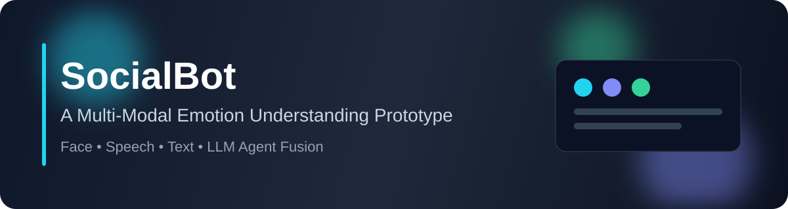

# SocialBot

A multi-modal **emotion understanding prototype** that combines:
- **Face** recognition pipeline
- **Speech** emotion pipeline
- **Text** sentiment/emotion pipeline
- **LLM Agent** for final emotion fusion and judgment

> This repository is a research prototype. Baseline models are provided, and each modality can be retrained or replaced with stronger models.

---

## ✨ Highlights

- Multi-source emotion signals (face, speech, text)
- Intermediate result aggregation to `emotion.txt` and `emotion4GPT.txt`
- LLM-assisted final emotion decision (`call.py`)
- Modular folder structure for independent model iteration

---

## 📦 Project Structure

```text
socialbot/
├── face/          # Face emotion pipeline + notebook
├── speech/        # Audio recording & speech emotion pipeline + notebook
├── text/          # Text input GUI + text emotion pipeline + notebook
├── LLM/           # Resources for downstream socialbot integration
├── call.py        # LLM-based final emotion decision
├── clear.py       # Reset round output files
├── emotion.txt    # Aggregated modality outputs
└── emotion4GPT.txt# Prompt-ready fused context for LLM
```

---

## 🚀 Quick Start

### 1) Reset previous round outputs

```bash
python clear.py
```

### 2) Run each modality pipeline

```bash
python text/text.py
python speech/recording.py
python speech/speech.py
python face/face.py
```

### 3) Run final LLM fusion

```bash
python call.py
```

The final decision is written to `GPT.txt`.

---

## 🧠 Training / Model Upgrade

Each modality folder includes a `train.ipynb` notebook:

- `face/train.ipynb`
- `speech/train.ipynb`
- `text/train.ipynb`

You can retrain baseline models or replace them with stronger checkpoints, then keep using the existing inference entry scripts.

---

## 🔄 Recommended End-to-End Workflow

1. Clear previous outputs (`clear.py`)
2. Collect text input (`text/text.py`)
3. Record and analyze speech (`speech/recording.py`, `speech/speech.py`)
4. Detect facial emotion (`face/face.py`)
5. Run LLM fusion (`call.py`)
6. Consume outputs in your own application logic under `LLM/` or external services

---

## ⚠️ Notes

- Current scripts use several hardcoded Windows-style paths (e.g., `D:\socialbot\...`).
- Before running on a new environment, update these paths to your local project location.
- API integration in `call.py` is a baseline example and should be adapted to your preferred LLM SDK/API style.

---

## 🛣️ Roadmap

- Improve robustness with stronger modality-specific models
- Add standardized config/CLI (remove hardcoded local paths)
- Introduce reproducible environment setup (requirements / lockfile)
- Build an integrated UI for one-click end-to-end inference

---

## 📄 License

No explicit license file is currently provided in this repository.  
Please add a license before production or external distribution use.
